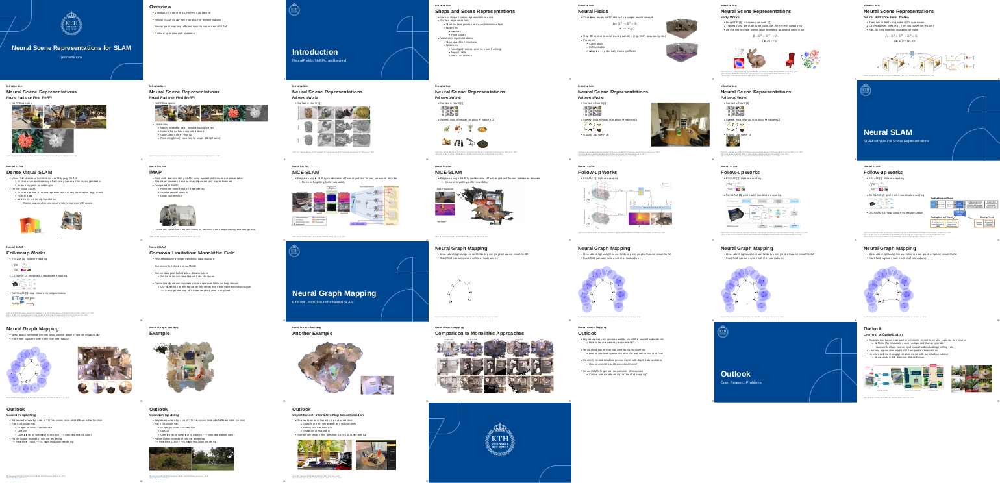

# Neural Scene Representations for SLAM
Slides on neural fields, SLAM with neural fields, and recent work on how to enable efficient loop closure in neural SLAM.



## Instructions
Slides are created with https://revealjs.com/.

You can view the slides by opening `index.html` in a web browser.

To serve the slides locally (giving you realtime updates), [get a recent node.js](https://github.com/nvm-sh/nvm?tab=readme-ov-file#install--update-script), then run the following commands in the root directory of this repository:
```
npm install
npm start
```
View the presentation at http://localhost:8000, and edit the slides in `index.html`. You can also create a PDF of the slides by appending `?print-pdf` to the URL allowing you to print the slides to a PDF file.
